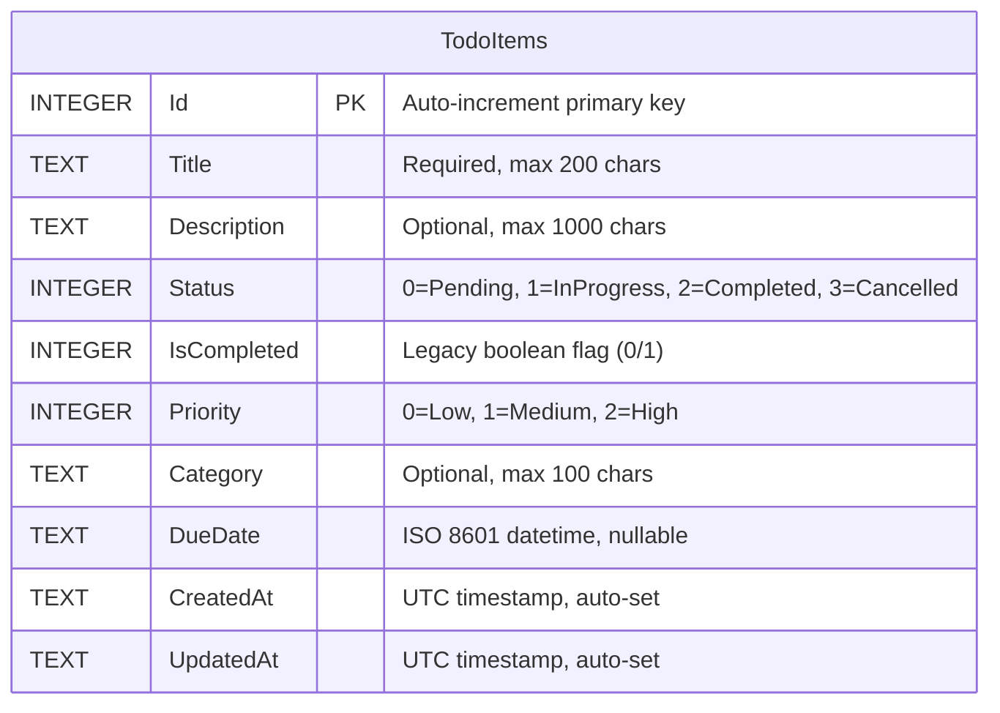

# ToDoApp — Database Design Document

> **Version**: 1.0  
> **Database Engine**: SQLite  
> **ORM**: Entity Framework Core 9  
> **Last Updated**: 2026-06-21  

---

## 1. Overview

This document describes the database schema for the **ToDoApp** task management application. The application uses a **SQLite** file-based database (`todos.db`) managed through **Entity Framework Core 9** with Code-First approach.

The database is auto-created at application startup via `DbContext.Database.EnsureCreated()` — no migration tooling is required for MVP.

---

## 2. Entity-Relationship Diagram



> **Note**: The current MVP has a single table. Future iterations may introduce `Users`, `Tags`, and `Projects` tables with foreign key relationships.

---

## 3. Table Schema: `TodoItems`

### 3.1 Column Definitions

| Column | SQLite Type | Nullable | Default | Constraints | Description |
|--------|-------------|----------|---------|-------------|-------------|
| `Id` | INTEGER | NO | Auto-increment | PRIMARY KEY, AUTOINCREMENT | Unique identifier for each task |
| `Title` | TEXT | NO | `''` | Required, MaxLength(200) | Short title describing the task |
| `Description` | TEXT | YES | NULL | MaxLength(1000) | Detailed description of the task |
| `Status` | INTEGER | NO | `0` (Pending) | — | Current workflow status (see enum below) |
| `IsCompleted` | INTEGER | NO | `0` (false) | — | Legacy convenience flag; `1` when Status = Completed |
| `Priority` | INTEGER | NO | `1` (Medium) | — | Urgency level (see enum below) |
| `Category` | TEXT | YES | NULL | MaxLength(100) | Optional grouping tag (e.g., "Development", "Design") |
| `DueDate` | TEXT | YES | NULL | — | Target completion date in ISO 8601 format |
| `CreatedAt` | TEXT | NO | `datetime('now')` | — | UTC timestamp when the record was created |
| `UpdatedAt` | TEXT | NO | `datetime('now')` | — | UTC timestamp when the record was last modified |

### 3.2 Enumerations

#### `TodoStatus` (stored as INTEGER)

| Value | Name | Description |
|-------|------|-------------|
| 0 | Pending | Task has been created but not started |
| 1 | InProgress | Task is actively being worked on |
| 2 | Completed | Task has been finished successfully |
| 3 | Cancelled | Task was abandoned or is no longer relevant |

#### `TodoPriority` (stored as INTEGER)

| Value | Name | Description |
|-------|------|-------------|
| 0 | Low | Non-urgent, can be deferred |
| 1 | Medium | Standard priority (default) |
| 2 | High | Urgent, should be addressed first |

---

## 4. Indexes

| Index Name | Column(s) | Purpose |
|------------|-----------|---------|
| `IX_TodoItems_Status_Priority` | `Status`, `Priority` | Optimizes the most common filter: active tasks sorted by urgency |
| `IX_TodoItems_DueDate` | `DueDate` | Speeds up due-date range queries and overdue detection |
| `IX_TodoItems_Category` | `Category` | Enables fast category-based filtering |
| `IX_TodoItems_CreatedAt` | `CreatedAt` | Supports chronological ordering of tasks |
| `IX_TodoItems_IsCompleted` | `IsCompleted` | Legacy boolean filter for quick "done/not-done" queries |

---

## 5. Seed Data

The application ships with 4 sample records for development and testing:

| Id | Title | Status | Priority | Category |
|----|-------|--------|----------|----------|
| 1 | Complete initial project setup | Completed | High | Development |
| 2 | Implement CRUD API controller | InProgress | High | Development |
| 3 | Design frontend UI | Pending | Medium | Design |
| 4 | Write unit tests | Pending | Low | Testing |

Seed data is injected via EF Core's `HasData()` method in `AppDbContext.OnModelCreating()`.

---

## 6. Data Access Patterns

### 6.1 Read Queries

| Operation | SQL Pattern | Index Used |
|-----------|-------------|------------|
| List all todos | `SELECT * FROM TodoItems ORDER BY CreatedAt DESC` | `IX_TodoItems_CreatedAt` |
| Get by ID | `WHERE Id = @Id` | Primary Key |
| Filter by status | `WHERE Status = @Status` | `IX_TodoItems_Status_Priority` |
| Filter by category | `WHERE Category = @Category` | `IX_TodoItems_Category` |
| Overdue items | `WHERE DueDate < datetime('now') AND Status NOT IN (2,3)` | `IX_TodoItems_DueDate` |
| Due within N days | `WHERE DueDate BETWEEN datetime('now') AND datetime('now', '+N days')` | `IX_TodoItems_DueDate` |
| Title search | `WHERE Title LIKE '%keyword%'` | Full scan (acceptable for MVP) |

### 6.2 Write Queries

| Operation | Description |
|-----------|-------------|
| Create | Insert with server-generated `CreatedAt`/`UpdatedAt` defaults |
| Update | Full or partial update; always refreshes `UpdatedAt` |
| Toggle | Flips `IsCompleted` and syncs `Status` accordingly |
| Delete | Hard delete by ID; bulk delete by status |

### 6.3 Analytics Queries

| Query | Description |
|-------|-------------|
| Dashboard summary | Aggregate counts by status + overdue count |
| Priority distribution | Count active tasks per priority level |
| Completion rate | Per-category completion percentage |

---

## 7. EF Core Configuration Details

### 7.1 Connection String

```json
{
  "ConnectionStrings": {
    "DefaultConnection": "Data Source=todos.db"
  }
}
```

### 7.2 DbContext Registration (Program.cs)

```csharp
builder.Services.AddDbContext<AppDbContext>(options =>
    options.UseSqlite(builder.Configuration.GetConnectionString("DefaultConnection")));
```

### 7.3 Auto-Creation Strategy

```csharp
using (var scope = app.Services.CreateScope())
{
    var dbContext = scope.ServiceProvider.GetRequiredService<AppDbContext>();
    dbContext.Database.EnsureCreated();
}
```

> **Important**: `EnsureCreated()` only creates the database if it does not exist. It does **not** apply migrations. For schema evolution beyond MVP, switch to `Database.Migrate()` with proper migration files.

---

## 8. SQLite-Specific Considerations

| Concern | Approach |
|---------|----------|
| **DateTime Storage** | SQLite has no native DATETIME type. All temporal values are stored as ISO 8601 TEXT strings. EF Core handles conversion transparently. |
| **Boolean Storage** | SQLite stores booleans as INTEGER (0/1). EF Core maps `bool` properties correctly. |
| **Enum Storage** | Enums are stored as INTEGER values via `HasConversion<int>()`. |
| **Concurrency** | SQLite uses file-level locking. Adequate for single-user or low-concurrency scenarios. |
| **Max Text Length** | SQLite does not enforce `MaxLength` at the database level. Enforcement is handled by EF Core validation and Data Annotations. |

---

## 9. Future Schema Evolution

The following enhancements are planned for post-MVP iterations:

| Feature | Schema Impact |
|---------|---------------|
| **User Authentication** | New `Users` table; `TodoItems.UserId` FK |
| **Tags/Labels** | New `Tags` table + `TodoItemTags` junction table (many-to-many) |
| **Projects** | New `Projects` table; `TodoItems.ProjectId` FK |
| **Subtasks** | Self-referencing FK: `TodoItems.ParentId → TodoItems.Id` |
| **Attachments** | New `Attachments` table with file metadata |
| **Audit Log** | New `AuditLogs` table tracking all mutations |

---

## 10. File Locations

| File | Path | Purpose |
|------|------|---------|
| Entity Model | `backend/ToDoApp.Api/Models/TodoItem.cs` | Domain entity definition |
| DbContext | `backend/ToDoApp.Api/Data/AppDbContext.cs` | EF Core context with Fluent API |
| DDL Script | `backend/ToDoApp.Api/Data/Queries/01_CreateTable.sql` | Raw CREATE TABLE + indexes |
| Seed Script | `backend/ToDoApp.Api/Data/Queries/02_SeedData.sql` | Initial data INSERT |
| CRUD Queries | `backend/ToDoApp.Api/Data/Queries/03_CRUD_Queries.sql` | All application query patterns |
| This Document | `docs/DATABASE_DESIGN.md` | Schema documentation |
